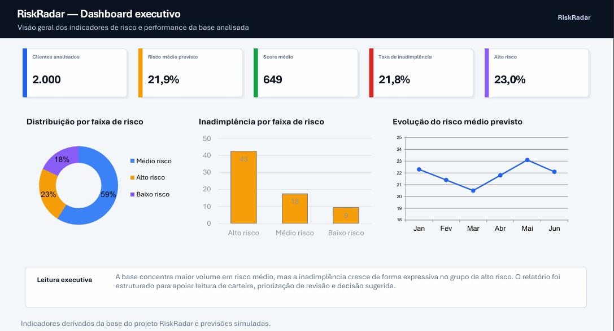
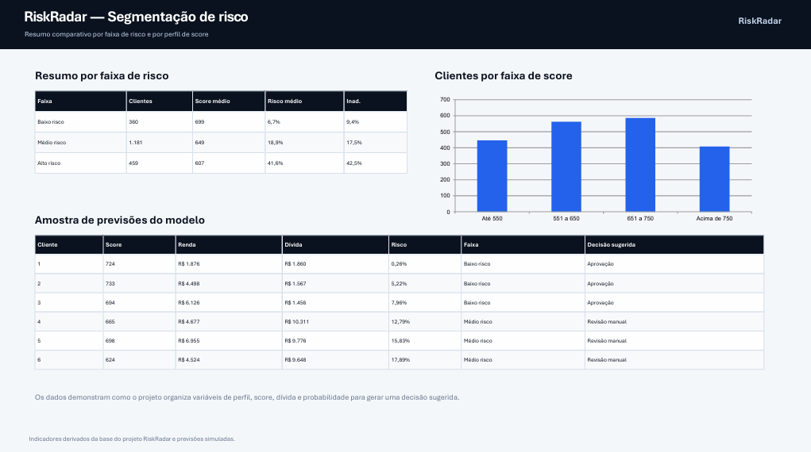

# RiskRadar – Sistema de Análise de Risco de Crédito

O **RiskRadar** é um projeto de estudo e simulação de um motor de análise de risco de crédito, inspirado em cenários reais utilizados por bancos e fintechs.

O objetivo principal é demonstrar, de forma prática, como dados financeiros e comportamentais podem ser utilizados para estimar a probabilidade de inadimplência de um cliente, integrando **Machine Learning**, **API**, **persistência em banco de dados** e **visualização de dados** em um único fluxo.

Este projeto foi construído de forma incremental, priorizando clareza, organização e evolução técnica ao longo do tempo.

---

## Tecnologias Utilizadas

* Python
* Pandas
* Scikit-learn
* FastAPI
* SQLite
* Streamlit
* Looker Studio
* Machine Learning
* Regressão Logística
* Feature Engineering

---

## Motivação

Em ambientes financeiros reais, decisões de crédito precisam ser:

* rápidas
* consistentes
* explicáveis
* integradas a sistemas

O RiskRadar nasce como um laboratório para explorar essas ideias, indo além de um modelo isolado e chegando a um **pipeline funcional**, com persistência em banco de dados, API de previsão e interface para simulação.

---

## Evolução do Modelo Preditivo

### Modelo v1 – Modelo inicial

A primeira versão do projeto utilizou um **modelo de Regressão Logística** treinado diretamente sobre os dados originais, com foco em:

* validação do problema
* entendimento das variáveis
* construção do primeiro pipeline de previsão

Esse modelo serviu como base conceitual e técnica para o restante do projeto.

---

### Modelo v2 – Modelo atual

A segunda versão do modelo representa uma evolução importante do projeto.

Nesta etapa foram introduzidos:

* **Feature Engineering**

  * criação e padronização de variáveis relevantes
  * uso explícito da relação dívida/renda
* **Normalização dos dados**

  * aplicação de `StandardScaler`
  * scaler treinado apenas no conjunto de treino
* **Persistência completa**

  * modelo salvo em arquivo (`model_v2.pkl`)
  * scaler salvo separadamente (`scaler_v2.pkl`)
  * ordem das features registrada em `feature_columns_v2.json`

Essa abordagem garante consistência entre treino e inferência, aproximando o projeto de um cenário real de produção.

**Atualmente, a API do RiskRadar utiliza exclusivamente o modelo v2.**

---

## Arquitetura Geral do Projeto

O projeto é organizado de forma modular, separando responsabilidades:

* **Dados**: base simulada de clientes
* **Modelagem**: scripts de treino e avaliação
* **API**: serviço de previsão de risco
* **Banco de dados**: persistência das previsões
* **Dashboard**: visualização e simulação interativa
* **Relatório**: leitura executiva dos indicadores gerados

A comunicação entre os componentes segue um fluxo simples e claro:

```text
entrada de dados → pré-processamento → modelo → persistência → visualização
```

---

## API de Previsão de Risco

A API foi desenvolvida com **FastAPI** e tem como responsabilidade:

* receber os dados do cliente
* aplicar o mesmo pré-processamento utilizado no treino
* carregar o scaler e o modelo persistidos
* calcular a probabilidade de inadimplência
* classificar o risco do cliente
* registrar a previsão no banco SQLite

A documentação interativa é disponibilizada via Swagger, facilitando testes e validações da API.

---

## Dashboard e Simulação

O dashboard foi construído com **Streamlit** e permite:

* visualizar previsões registradas
* acompanhar métricas agregadas de risco
* simular novos clientes
* consultar o risco via API
* analisar graficamente a distribuição de risco da carteira simulada

Essa camada reforça a visão de negócio do projeto, indo além do código e aproximando a solução de uma aplicação prática.

---

## Dashboard e Visualizações

Além da implementação técnica em Python, o projeto também possui uma camada de visualização de dados para facilitar a leitura dos resultados e apoiar a tomada de decisão.

O dashboard apresenta indicadores como:

* total de clientes analisados
* risco médio previsto
* score médio da carteira
* taxa de inadimplência
* distribuição por faixa de risco
* inadimplência por faixa de risco
* evolução do risco médio previsto
* amostra das previsões do modelo
* decisão sugerida com base na classificação de risco

### Dashboard interativo

Acesse o dashboard no Looker Studio:

[Ver dashboard RiskRadar](https://datastudio.google.com/s/ovOuOhOX1Ko)

### Visão geral do dashboard



### Segmentação de risco e amostra das previsões



As visualizações foram criadas para demonstrar como os dados do projeto podem ser organizados em indicadores e relatórios, simulando uma leitura de carteira de crédito.

---

## Indicadores Analisados

Entre os principais indicadores acompanhados no projeto estão:

* **Clientes analisados**: quantidade total de registros avaliados
* **Risco médio previsto**: média da probabilidade estimada de inadimplência
* **Score médio**: média do score interno dos clientes
* **Taxa de inadimplência**: proporção de clientes inadimplentes na base
* **Faixa de risco**: classificação dos clientes em baixo, médio ou alto risco
* **Relação dívida/renda**: indicador de comprometimento financeiro
* **Decisão sugerida**: recomendação simulada de aprovação, revisão manual ou análise restritiva

---

## Estrutura do Projeto

```text
riskradar/
├── assets/
│   ├── relatorio-1.png
│   └── relatorio-2.png
├── dashboard/
├── data/
├── models/
├── notebooks/
├── src/
├── README.md
├── requirements.txt
├── risk.db
├── save_prediction_test.py
├── train.py
└── train_v2.py
```

---

## Próximos Passos

Os próximos passos planejados para o projeto incluem:

* comparação formal entre o modelo v1 e v2, usando métricas como AUC e F1-score
* inclusão de explicabilidade do modelo, como SHAP
* definição mais refinada de thresholds de decisão
* separação entre aprovação, revisão manual e recusa
* simulações de estresse da carteira de crédito
* melhoria visual do dashboard em Streamlit
* evolução das visualizações em ferramentas de BI
* criação de uma documentação mais detalhada da API

Essas evoluções serão feitas mantendo o foco em clareza, explicabilidade e aplicabilidade prática.

---

## Considerações Finais

O RiskRadar não tem como objetivo ser um produto final, mas sim um **projeto evolutivo**, que demonstra capacidade técnica, visão de sistema e entendimento do problema de crédito de ponta a ponta.

Ele reflete decisões conscientes ao longo do desenvolvimento, valorizando mais a construção sólida do que soluções excessivamente complexas.

O projeto mostra a integração entre análise de dados, modelagem preditiva, API, banco de dados e visualização, simulando um fluxo próximo ao utilizado em contextos reais de análise de risco.
